# PiNNTORP

> A browser-based gaming platform built with vanilla JavaScript, with live game mechanics, a friends system, player statistics, and a game recommendation engine.


---

## Table of Contents

- [Overview](#overview)
- [Features](#features)
- [Screenshots](#screenshots)
- [Architecture](#architecture)
- [Getting Started](#getting-started)
- [Running Tests](#running-tests)
- [Project Documentation](#project-documentation)
- [Git Workflow](#git-workflow)
- [Iteration Plan](#iteration-plan)
- [Team](#team)

---

## Overview

PiNNTORP is a web-based gambling platform. Users can play 4 different gambling games, track their win/loss statistics, manage their own friends list, and receive personalized game recommendations. Everything is stored locally in the browser.

---

## Features

| Feature | Status |
|---------|--------|
| Dice Roll game | Implemented |
| Slot Machine game | Implemented |
| Coin Flip game | Implemented |
| Blackjack game | Implemented |
| Friends list (add/remove/request) | Implemented |
| Player statistics & win/loss ratio | Implemented |
| Player balance & Earn tab | Implemented |
| Game recommendation algorithm | Implemented |
| Global leaderboard | Implemented |
| Game history on profile | Implemented |
| Account deletion | Implemented |

---
## Screenshots

### Login & Sign Up

<p align="center">
  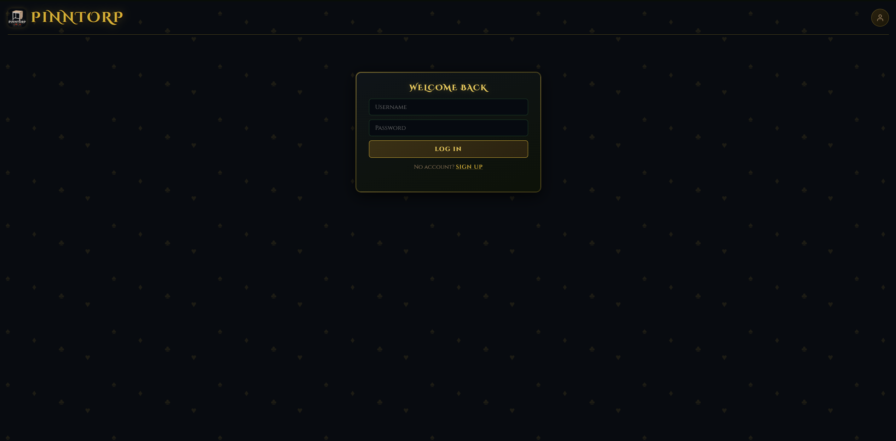
  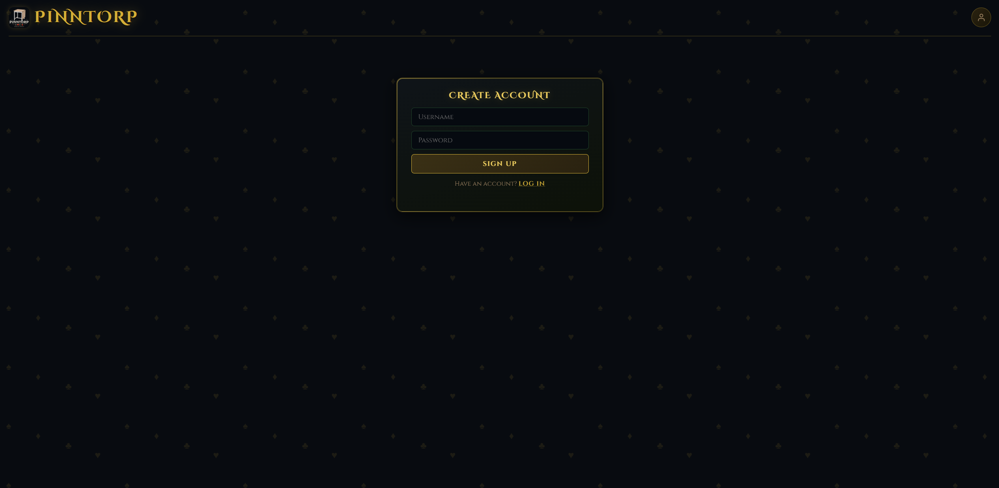
</p>

### Home Page

<p align="center">
  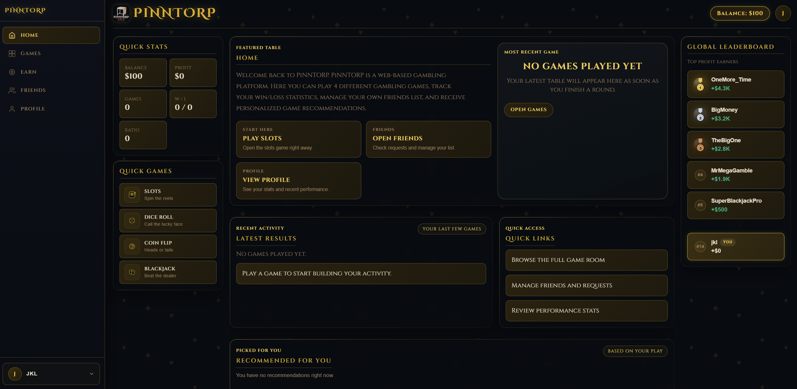
</p>

<p align="center">
  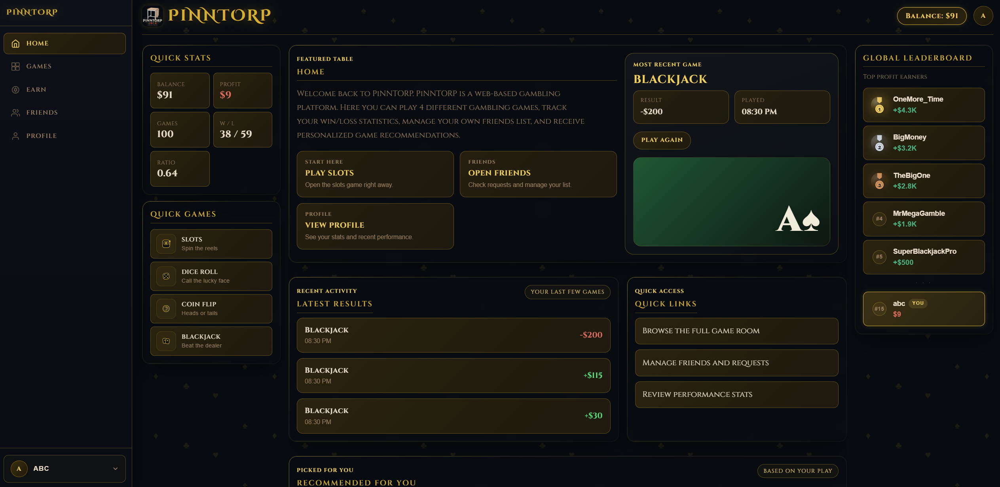
</p>

### Games Tab

<p align="center">
  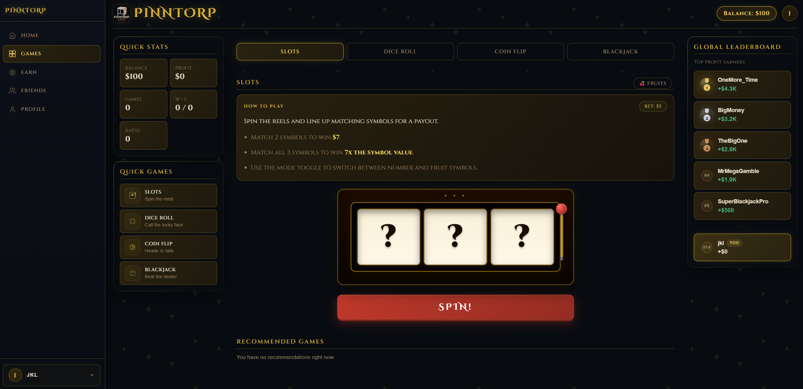
  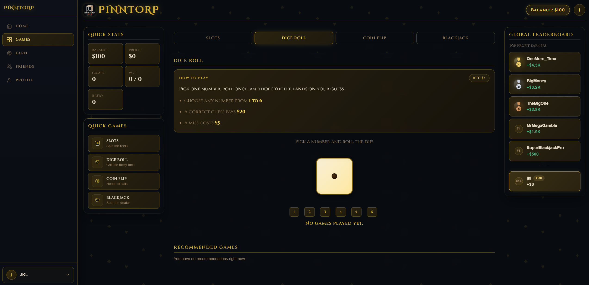
  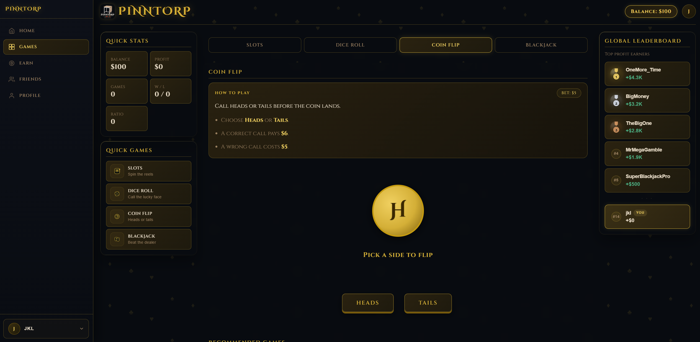
  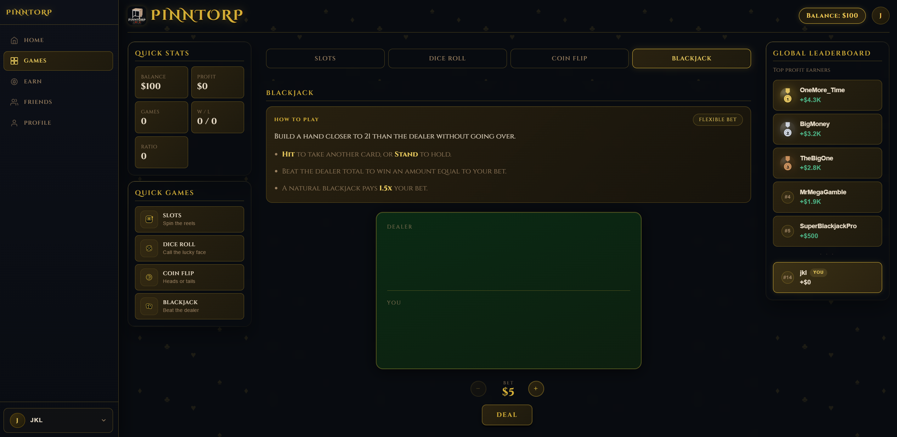
</p>

<p align="center">
  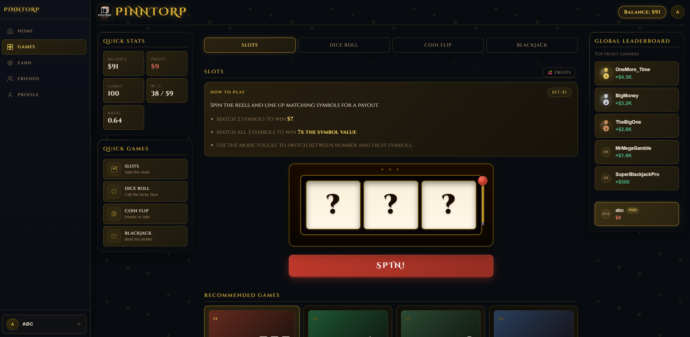
</p>

### Earn Tab

<p align="center">
  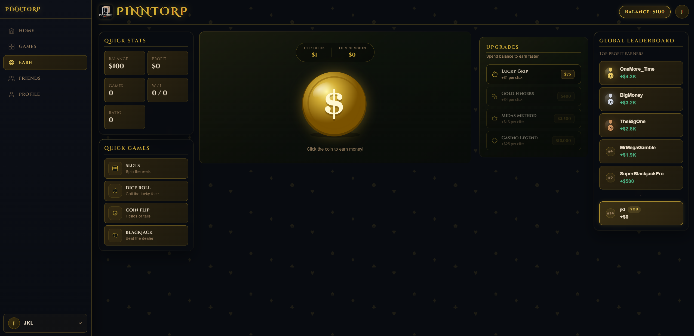
</p>

### Friends Tab

<p align="center">
  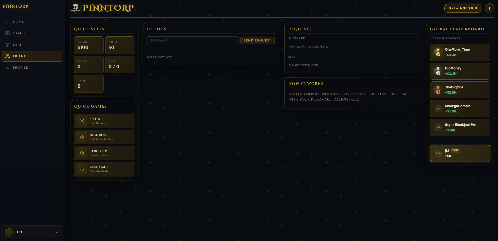
  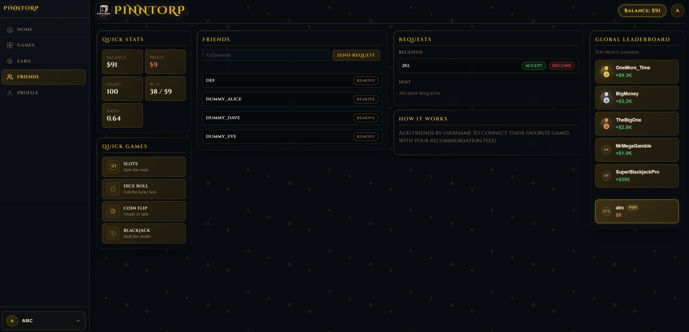
</p>

### Profile Tab

<p align="center">
  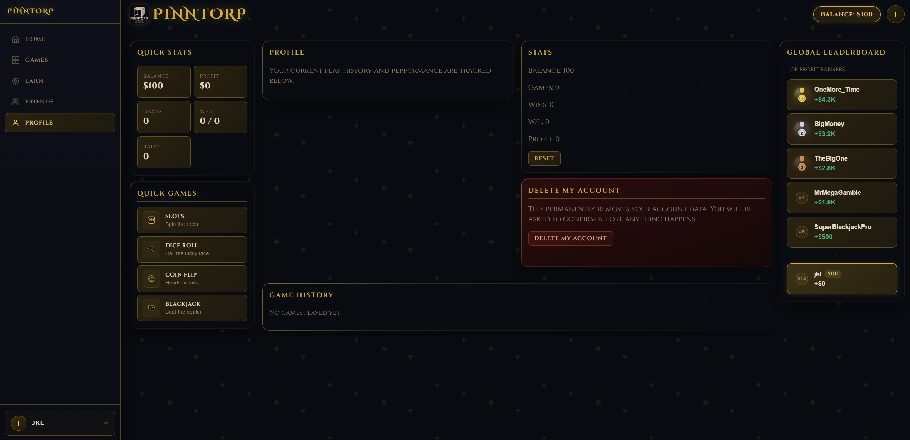
  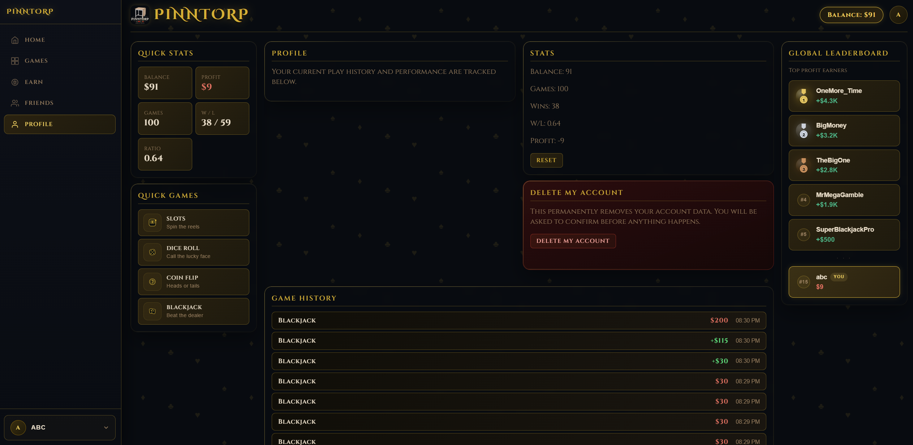
</p>


## Architecture

The project utilizes a **Hybrid Unified Architecture**:
- **Frontend**: Modular ES6 JavaScript managing UI and local state fallback.
- **Backend**: A single Java Unified Server (Port 8080) handling static files, RESTful API, and WebSockets.

```
PiNNTORP/
├── pinn-api/          ← Unified Java Server (HTTP + WS)
├── js/                ← Frontend Logic
│   ├── core/          ← networking, state & storage
│   ├── game/          ← game engine & individual games
│   ├── account/       ← auth & session management
│   └── friends/       ← social graph logic
└── docs/iter3/        ← Iteration 3 Architecture & Writeup
```

*For a detailed breakdown, see [Iteration 3 Architecture](docs/iter3/ARCHITECTURE.md).*


---

## Getting Started

### Requirements

- A modern web browser (Chrome, Edge, Firefox, etc.)
- One of the following on your system `PATH`:
  - **Python 3**
  - **Node.js 18+** with `npx`

### How to run

**Option 1: Desktop (Windows):**

```
Double-click start-server.bat
```

**Option 2: Terminal (Linux/macOS/Windows WSL):**

Ensure you have a JDK (Java 17+) installed and on your PATH, then run:

```bash
./start-server.sh
```

**Option 3: Docker (Containerized):**

If you have Docker and Docker Compose installed, you can launch the platform with a single command:

```bash
docker-compose up --build -d
```

Then open [http://localhost:8080](http://localhost:8080) in your browser.

> Note: The unified Java server automatically serves the frontend assets and handles the API on port 8080.

---

## Running Tests

```bash
npm test
```

Tests use Node's built-in test runner and their current coverage includes the `friends.js` and `stats.js` modules, with unit tests for every public method.

---

## Project Documentation

All diagrams and iteration artifacts are located in the [`docs/`](docs/) directory.

| Artifact | Location |
|----------|----------|
| UML Class & Sequence Diagrams | [`docs/iter1/ITERATION1_UML.MD`](docs/iter1/ITERATION1_UML.MD) |
| Iteration 1 Task Board | [`docs/iter1/ITERATION1_TASK_BOARD.md`](docs/iter1/ITERATION1_TASK_BOARD.md) |
| Iteration 1 Burndown Chart | [`docs/iter1/ITERATION1_BURNDOWN.md`](docs/iter1/ITERATION1_BURNDOWN.md) |
| Iteration 1 Retrospective & Velocity | [`docs/iter1/ITERATION1_RETRO_VELOCITY_ETC.md`](docs/iter1/ITERATION1_RETRO_VELOCITY_ETC.md) |
| WebSocket Statechart | [`docs/iter2/ITERATION2_STATECHART.md`](docs/iter2/ITERATION2_STATECHART.md) |
| Iteration 2 Task Board | [`docs/iter2/ITERATION2_TASK_BOARD.md`](docs/iter2/ITERATION2_TASK_BOARD.md) |
| Iteration 2 Burndown Chart | [`docs/iter2/ITERATION2_BURNDOWN.md`](docs/iter2/ITERATION2_BURNDOWN.md) |
| Iteration 3 Architecture | [`docs/iter3/ARCHITECTURE.md`](docs/iter3/ARCHITECTURE.md) |
| Iteration 3 API Reference | [`docs/iter3/API.md`](docs/iter3/API.md) |
| Iteration 3 Writeup | [`docs/iter3/ITERATION3_WRITEUP.md`](docs/iter3/ITERATION3_WRITEUP.md) |
| Iteration 3 Burndown Chart | [`docs/iter3/ITERATION3_BURNDOWN.md`](docs/iter3/ITERATION3_BURNDOWN.md) |
| Iteration 3 Customer Meeting | [`docs/iter3/ITERATION3_CUSTOMER_MEETING.md`](docs/iter3/ITERATION3_CUSTOMER_MEETING.md) |

---

## Git Workflow

```
feature/*  →  develop  →  (team review)  →  main
```

| Branch | Purpose |
|--------|---------|
| `main` | Stable demo only |
| `develop` | Integration branch |
| `feature/*` | Individual contributor branches |

All contributors are expected to branch off `develop`, and merge back into `develop` after review. Merges to `main` happen at the end of each iteration.

---

## Iteration Plan

| Iteration | Duration | Focus | Key Deliverables |
|-----------|----------|-------|------------------|
| 1 | Mar 3 - Mar 9, 2026 | Core platform | Game mechanics, friends list, statistics display |
| 2 | Mar 10 - Mar 23, 2026 | Intelligence layer | Recommendation algorithm, back-end integration, TDD |
| 3 | Mar 24 - Apr 6, 2026 | Polish & wrap-up | Account deletion, documentation, final testing |

**Team velocity:** `26 developer days per iteration`  
**Iteration capacity:** `28 developer days (4 devs * 14 days * 0.5 availability factor)`

---

## Team

| Name | Role |
|------|------|
| Eric Beaulne | Project Manager |
| Adrian Ahmadi | Front-End Lead |
| Nikola Grujin | Back-End Lead |
| Hayden Dunn | Software Quality Lead & Technical Manager |

---

