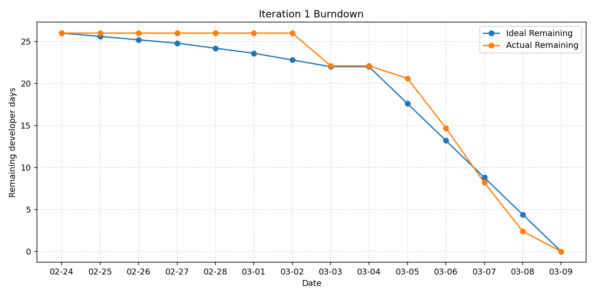

# Iteration 1 Burndown

Start date: **2026-02-24**

Iteration 1 length: **14d**
| Effort unit: **developer days**
| Total planned implementation effort (for the core mechanics): **26d**

| Day | Date | Ideal Remaining | Actual Remaining | Progress / Context |
|---:|---|---:|---:|---|
| 0 | 2026-02-24 | 26.0 | 26.0 | Iteration 1 kickoff: define scope, break down tasks, and begin planning |
| 1 | 2026-02-25 | 25.6 | 26.0 | Task board finalized: iteration 1 tasks are identified, estimated, and assigned |
| 2 | 2026-02-26 | 25.2 | 26.0 | Requirements reviewed and priorities clarified for iteration 1 scope |
| 3 | 2026-02-27 | 24.8 | 26.0 | Repository setup completed |
| 4 | 2026-02-28 | 24.2 | 26.0 | Burndown tracking prepared and planning materials refined for the customer meeting |
| 5 | 2026-03-01 | 23.6 | 26.0 | Final planning pass: board, estimates, assignments, and repo setup ready for review |
| 6 | 2026-03-02 | 22.8 | 26.0 | Final pre-meeting polish: running skeleton, board, and burndown ready for customer review |
| 7 | 2026-03-03 | 22.0 | 22.1 | Lab 6 customer meeting: present running skeleton, task board, repository setup, and in-progress burndown |
| 8 | 2026-03-04 | 22.0 | 22.1 | Post-meeting development begins: start core gameplay implementation |
| 9 | 2026-03-05 | 17.6 | 20.6 | Friends list development in progress (add/list/delete + persistence checks) |
| 10 | 2026-03-06 | 13.2 | 14.7 | Statistics display and win/loss ratio wiring in progress |
| 11 | 2026-03-07 | 8.8 | 8.2 | Feature integration pass on develop with the repository audit and retrospective draft in progress |
| 12 | 2026-03-08 | 4.4 | 2.4 | Prepare Lab 7 assets: UML class diagram, sequence diagram, updated requirement priorities, burndown, and velocity |
| 13 | 2026-03-09 | 0.0 | 0.0 | Iteration 1 closeout complete; handoff ready for Iteration 2 starting March 10 |

The formula used to estimate the actual remaining days is `remaining_days = total_days * (1 - percent_complete / 100)`. And the chart does not reflect non-core program elements such as repo setups, and documentation.
## Burndown Plot

