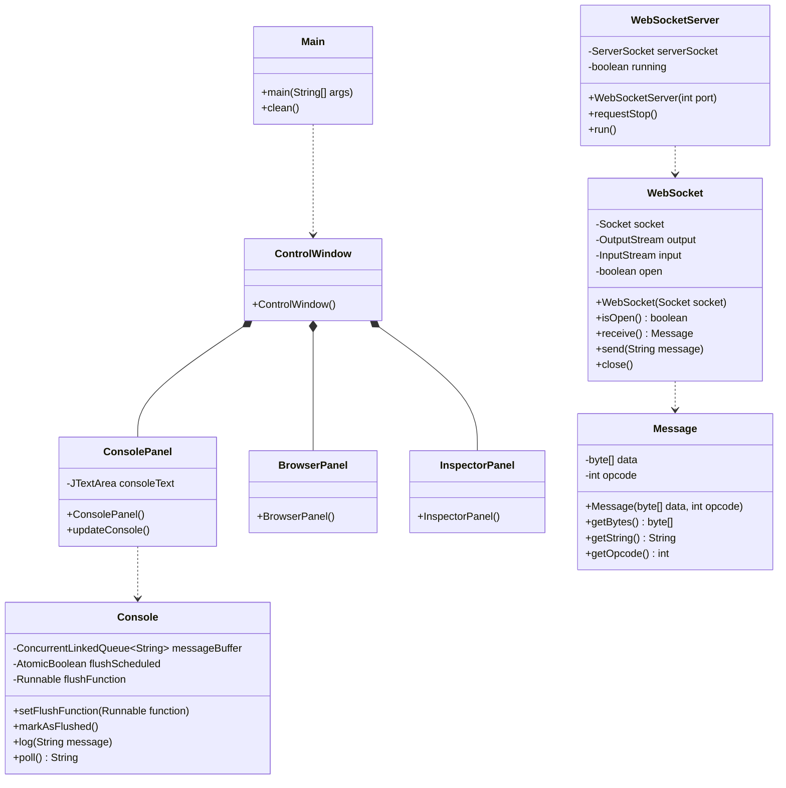
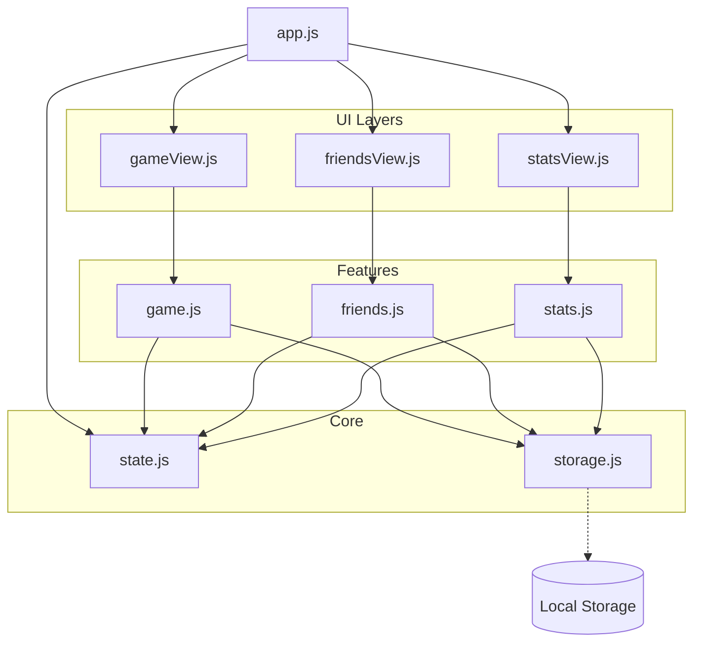
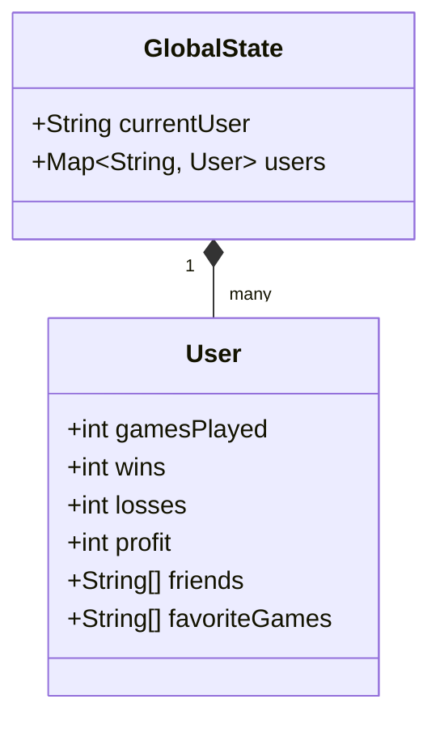
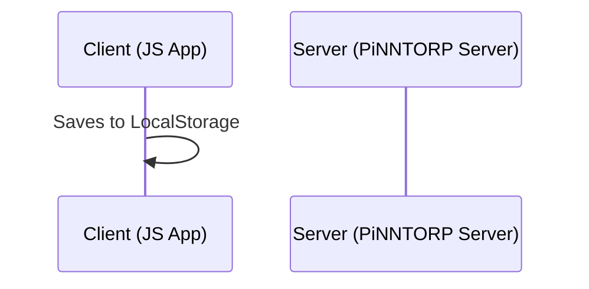

# PiNNTORP System Architecture

This document contains UML diagrams representing the current state of both the Java backend and the JavaScript frontend aswell as the connection between them.

## 1. Backend (Java) Class Diagram

---

## 2. Frontend (JavaScript) Module Diagram

---

## 3. Data Structure (State)
The frontend state is shaped as follows:

---

## 4. Current Connection Status
Currently, there is **no communication** between these two systems.

