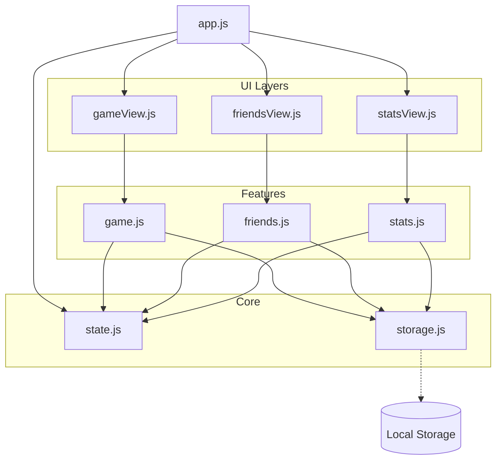
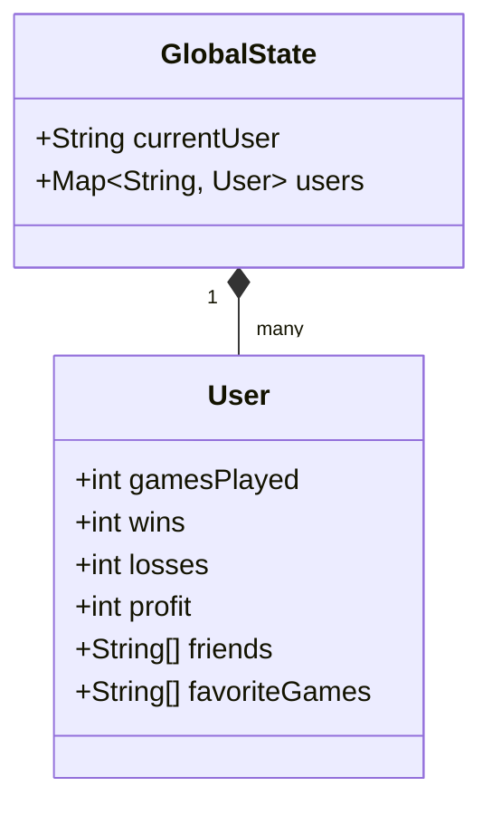
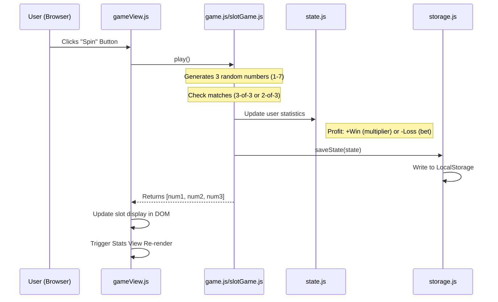

# PiNNTORP System Architecture

This document contains UML diagrams representing the current state of both the Java backend and the JavaScript frontend aswell as the connection between them.

## 1. Frontend Module Relationships
The frontend is built with vanilla JavaScript using a modular approach.

---

## 2. Frontend Data Structure
The state of the application is centralized.

---

## 3. Game Flow: Slots
The following sequence diagram shows the flow of a single round of the Slots from user interaction to data persistence.

