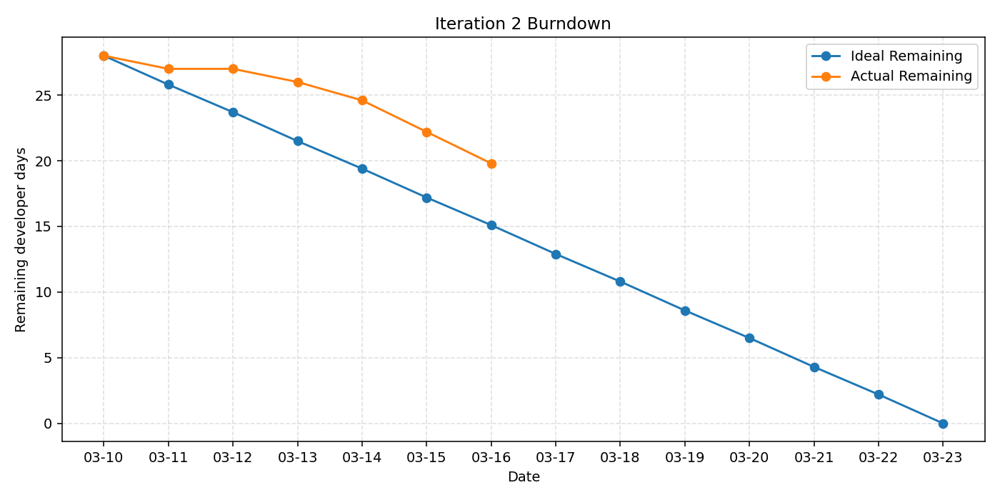

# Iteration 2 Burndown

Start date: **2026-03-10**

Iteration 2 length: **14d**
| Effort unit: **developer days**
| Total planned implementation effort: **28d**

| Day | Date | Ideal Remaining | Actual Remaining | Progress / Context |
|---:|---|---:|---:|---|
| 0 | 2026-03-10 | 28.0 | 28.0 | Iteration 2 planning |
| 1 | 2026-03-11 | 25.8 | 27.0 | Algorithm planning |
| 2 | 2026-03-12 | 23.7 | 27.0 | Test planning |
| 3 | 2026-03-13 | 21.5 | 26.0 | Game planning |
| 4 | 2026-03-14 | 19.4 | 24.6 | Lab 8 prep |
| 5 | 2026-03-15 | 17.2 | 22.2 | More planning |
| 6 | 2026-03-16 | 15.1 | 19.8 | Final Lab 8 prep |
| 7 | 2026-03-17 | 12.9 | - | Lab 8 meeting |
| 8 | 2026-03-18 | 10.8 | - | Algorithm work |
| 9 | 2026-03-19 | 8.6 | - | Game work |
| 10 | 2026-03-20 | 6.5 | - | TDD work |
| 11 | 2026-03-21 | 4.3 | - | Integration work |
| 12 | 2026-03-22 | 2.2 | - | Lab 9 prep |
| 13 | 2026-03-23 | 0.0 | - | Iteration complete |

The formula used to estimate the actual remaining days is `remaining_days = total_days * (1 - percent_complete / 100)`.
## Burndown Plot

