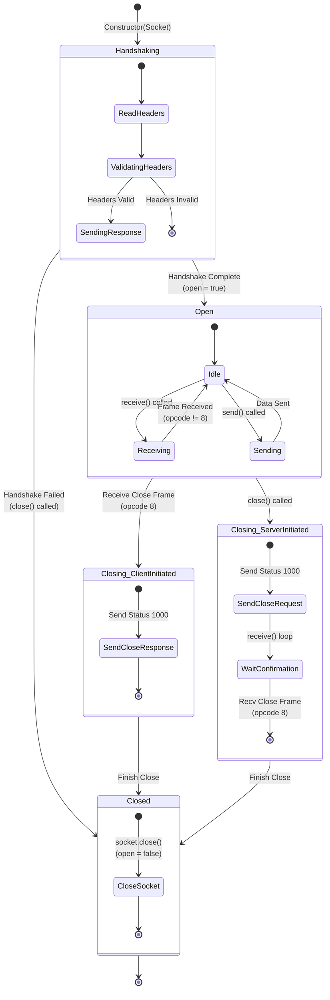

# WebSocket Statechart Diagram

The following diagram represents the lifecycle and operational states of the `WebSocket.java` class, including handshaking, active communication, and connection termination processes.

