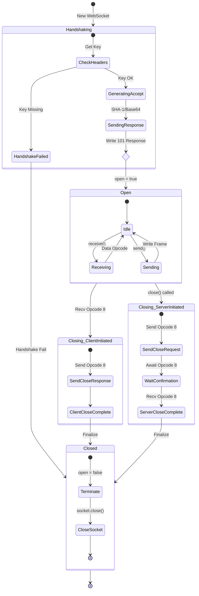

# WebSocket Statechart Diagram (Iteration 2)

The following diagram represents the lifecycle and operational states of the `WebSocket.java` class with concise transitions.

```mermaid
stateDiagram-v2
    [*] --> Handshaking: New WebSocket
    
    state Handshaking {
        [*] --> CheckHeaders: Get Key
        
        state HandshakeSuccess <<choice>>
        CheckHeaders --> GeneratingAccept: Key OK
        CheckHeaders --> HandshakeFailed: Key Missing
        
        GeneratingAccept --> SendingResponse: SHA-1/Base64
        SendingResponse --> HandshakeSuccess: Write 101 Response
    }
    
    HandshakeSuccess --> Open: open = true
    HandshakeFailed --> Closed: Handshake Fail
    
    state Open {
        [*] --> Idle
        Idle --> Receiving: receive()
        Receiving --> Idle: Data Opcode
        
        Idle --> Sending: send()
        Sending --> Idle: Write Frame
    }
    
    Open --> Closing_ClientInitiated: Recv Opcode 8
    Open --> Closing_ServerInitiated: close() called
    
    state Closing_ClientInitiated {
        [*] --> SendCloseResponse: Send Opcode 8
        SendCloseResponse --> ClientCloseComplete
    }
    
    state Closing_ServerInitiated {
        [*] --> SendCloseRequest: Send Opcode 8
        SendCloseRequest --> WaitConfirmation: Await Opcode 8
        WaitConfirmation --> ServerCloseComplete: Recv Opcode 8
    }
    
    ClientCloseComplete --> Closed: Finalize
    ServerCloseComplete --> Closed: Finalize
    
    state Closed {
        [*] --> Terminate: open = false
        Terminate --> CloseSocket: socket.close()
        CloseSocket --> [*]
    }

    Closed --> [*]
```
