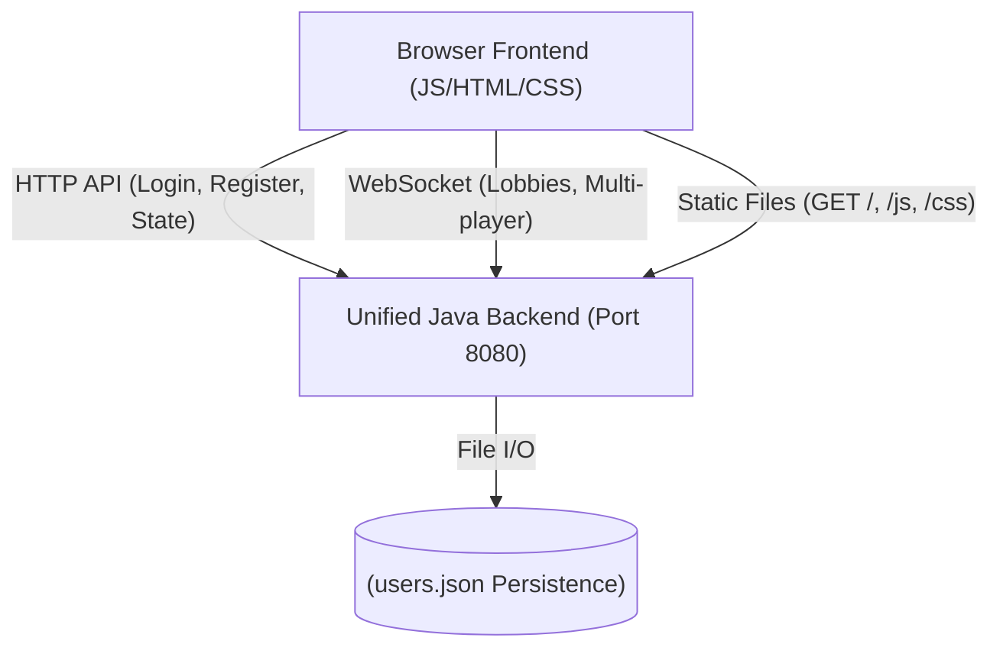
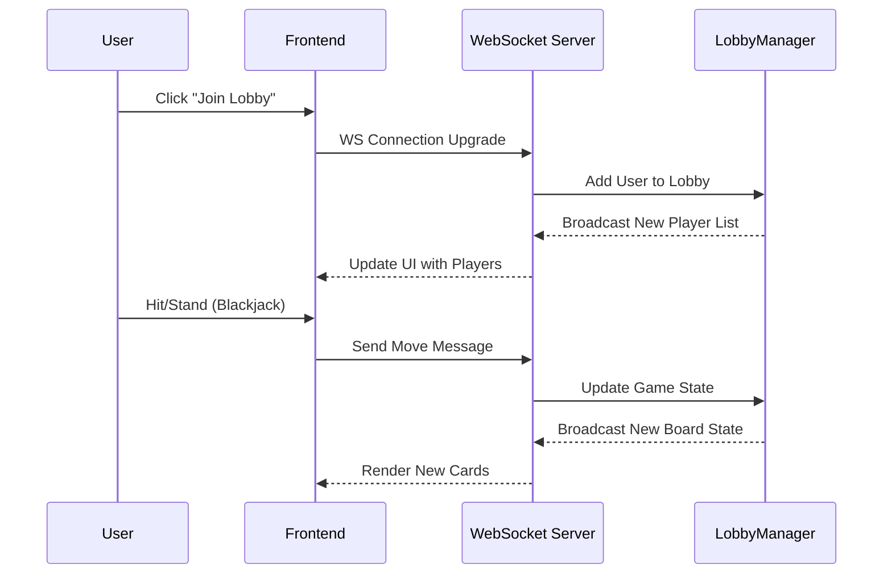

# PiNNTORP Architecture Overview (Iteration 3)

Iteration 3 marks a significant architectural shift from a decentralized, client-side heavy application to a unified, server-authoritative system with support for real-time multiplayer features.

## 1. High-Level Architecture

The system follows a **Hybrid Client-Server Architecture**. While the application can function in a "Local Mode" using Browser LocalStorage, the primary experience is driven by a unified Java Backend that handles authentication, data persistence, and multiplayer game logic.

## 2. Component Descriptions

### 2.1 Unified Java Backend (`pinn-api/`)
The backend has been consolidated into a single server instance running on **Port 8080**. It serves three main roles:
- **Static File Server**: Delivers the frontend assets (HTML, JS, CSS) to the browser.
- **RESTful API**: Provides endpoints for user authentication (`/api/login`, `/api/register`) and state management (`/api/state`).
- **WebSocket Server**: Manages real-time bidirection communication for multiplayer game lobbies and life updates.

### 2.2 Frontend Application (`js/`)
The frontend is built with vanilla JavaScript using a modular approach:
- **`core/`**: Manages application state and low-level storage/network abstractions.
- **`account/`**: Handles login/logout and session management.
- **`game/`**: Contains the game engine and individual game modules (Blackjack, Dice Roll, etc.).
- **`friends/`**: Manages the social graph and friend requests.
- **`stats/` & `recommendation/`**: Tracks player performance and suggests new games based on friend activity.

### 2.3 Hybrid Logic Pattern
A key feature of Iteration 3 is the **Authoritative Graceful Fallback**. Games like Dice Roll and Slot Machine check for an active backend session:
1. **Online**: The client sends a request to the server API (e.g., `/api/dice`), which calculates the result and updates the database.
2. **Offline**: If the server is unreachable or no session exists, the client falls back to local random logic and saves progress to `localStorage`.

## 3. Data Flow (Multiplayer Lobby)

The multiplayer system uses WebSockets for low-latency updates:

## 4. Key Improvements in Iteration 3

- **Unified Port (8080)**: Eliminated the need for multiple servers (Port 5000/5500/8080) and simplified CORS configuration via a shared origin.
- **Centralized UserStore**: User data is no longer isolated to the browser; it is persisted in a server-side JSON database, allowing for cross-device sessions and shared leaderboards.
- **JWT-Based Authentication**: Secure session management using JSON Web Tokens (JWT) passed in the `Authorization` header for all protected API calls.
- **Real-time Synchronization**: WebSockets allow for instant updates to the friends list and multiplayer game status.
