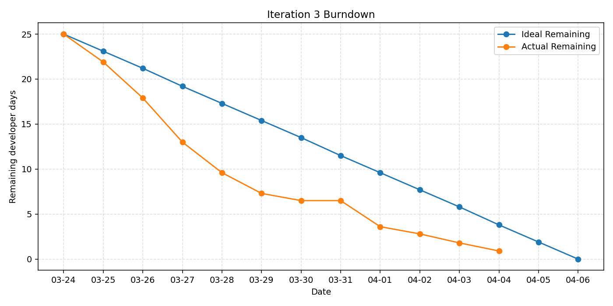

# Iteration 3 Burndown

Start date: **2026-03-24**

Iteration 3 length: **14d**
| Effort unit: **developer days**
| Total planned implementation effort: **25d**

| Day | Date | Ideal Remaining | Actual Remaining | Progress / Context |
|---:|---|---:|---:|---|
| 0 | 2026-03-24 | 25.0 | 25.0 | Iteration 3 planning |
| 1 | 2026-03-25 | 23.1 | 21.9 | Accounts + polishing work begins |
| 2 | 2026-03-26 | 21.2 | 17.9 | Accounts + polishing progress |
| 3 | 2026-03-27 | 19.2 | 13.0 | Lab 10 customer meeting; bulk of polishing done |
| 4 | 2026-03-28 | 17.3 | 9.6 | Accounts nearly complete; docs picking up |
| 5 | 2026-03-29 | 15.4 | 7.3 | Lab 10 docs complete, accounts mostly done |
| 6 | 2026-03-30 | 13.5 | 6.5 | Account deletion implementation |
| 7 | 2026-03-31 | 11.5 | 6.5 | Account deletion + testing |
| 8 | 2026-04-01 | 9.6 | 3.6 | Account deletion complete; docs progress |
| 9 | 2026-04-02 | 7.7 | 2.8 | Full test suite progress |
| 10 | 2026-04-03 | 5.8 | 1.8 | Documentation review + polishing wrap-up |
| 11 | 2026-04-04 | 3.8 | 0.9 | Final integration testing |
| 12 | 2026-04-05 | 1.9 | - | Lab 11 prep |
| 13 | 2026-04-06 | 0.0 | - | Iteration complete, prepare for delivery. |

The formula used to estimate the actual remaining days is `remaining_days = total_days * (1 - percent_complete / 100)`.
## Burndown Plot

## Updated Velocity

Iteration in progress. As of **2026-04-04** (day 11), **0.9 developer days** remain out of **25** planned.
The team has completed **24 developer days** of tracked work so far.

`Projected velocity = 24 developer days (partial, day 11 of 13)`

Using the baseline team capacity of **4 developers x 14 days x 0.5 availability = 28 developer days**, the tracked implementation work used about **86%** of total iteration capacity.
